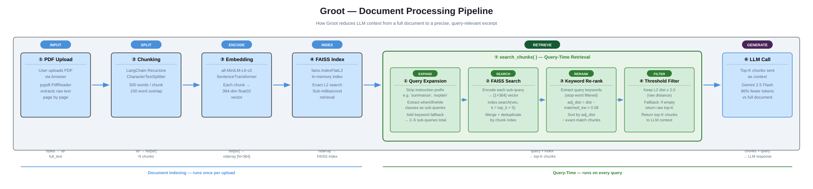

# 🌿 Groot - AI Document Context Optimizer

A Streamlit application that reduces AI language model costs by retrieving only the document sections relevant to a query, instead of sending the entire document as context.

## 📋 Table of Contents

- [Overview](#overview)
- [How It Works](#how-it-works)
- [Architecture](#architecture)
- [Getting Started](#getting-started)
- [Project Structure](#project-structure)
- [Usage Guide](#usage-guide)
- [Technology Stack](#technology-stack)
- [Configuration](#configuration)
- [Deployment](#deployment)
- [Performance](#performance)
- [Environment Impact](#environment-impact)

---

## 🎯 Overview

When processing large documents with AI models, organizations typically pass the entire document as context — leading to high token consumption, inflated API costs, and slower inference. Groot solves this by using semantic vector search to extract only the chunks of a document that are relevant to a specific query, reducing context size by up to 96% while maintaining response quality.

---

## 🔍 How It Works

When you upload a PDF, Groot reads it page by page using **pypdf** and concatenates all the extracted text into a single string — the raw full document. This full text is what a naive LLM integration would send directly to the model, costing tens of thousands of tokens on every query.

Instead, Groot immediately splits that text into overlapping chunks using **LangChain's RecursiveCharacterTextSplitter**. Each chunk is roughly 500 words (≈2,500 characters) with a 100-word overlap between adjacent chunks. The overlap ensures that a sentence split across a chunk boundary still appears fully in at least one chunk, so no fact gets lost at the seam.

Every chunk is then passed through **all-MiniLM-L6-v2**, a local SentenceTransformer model that runs entirely on the server with no API calls. It converts each chunk into a 384-dimensional float32 vector — a point in mathematical space where semantically similar text lands close together. All these vectors are loaded into a **FAISS IndexFlatL2**, an in-memory index that can find the nearest neighbours to any query vector in under a millisecond regardless of document size. This entire indexing process runs in a background thread so the UI stays responsive.

When you type a query, Groot does not simply embed it and search once. It first runs **query expansion**: it strips instruction words like "summarize" or "explain" to expose the core topic, then uses a regex to extract any conditional clauses (phrases starting with *when*, *if*, *while*, *during*, etc.) as separate sub-queries — because the document likely uses that exact conditional phrasing in the answer. It also adds a keyword-only fallback. The result is 2–5 search strings from a single user query.

Each sub-query is independently embedded and searched against the FAISS index, fetching a pool of `top_k × 5` candidates. All results are merged and deduplicated by chunk position. The candidates are then **re-ranked**: for every query keyword that appears literally in a chunk's text, its effective distance is reduced by 0.08. This means a chunk containing the exact domain terms from the query floats above a chunk that is only semantically similar — which is what catches specific operational facts that pure vector similarity misses. Finally, any candidate with a raw L2 distance above 2.0 is dropped, and the best `top_k` chunks are returned.

Those chunks — typically 3–8% of the original document's tokens — are joined and sent to **Gemini** as the context window. The same query is also sent with the full raw document so you can compare responses side by side. Groot displays the token counts, costs, and savings for both paths so the quality-versus-cost tradeoff is immediately visible.

---

## 🏗️ Architecture



> The draw.io source (`groot-core-pipeline.drawio`) is also in the repo — open it at [diagrams.net](https://app.diagrams.net) or in the draw.io desktop app for an editable version.

---

## 🚀 Getting Started

### Prerequisites

- Python 3.11 or higher
- Google Gemini API key (or Vertex AI credentials for Cloud Run)

### Installation

```bash
git clone <repository-url>
cd groot
python -m venv .venv

# Windows
.venv\Scripts\activate
# macOS/Linux
source .venv/bin/activate

pip install -r requirements.txt
```

### Running Locally

```bash
streamlit run app.py
```

Opens at `http://localhost:8501`

---

## 📁 Project Structure

```
groot/
├── app.py                          # Main Streamlit application & page router
├── utils.py                        # Facade module re-exporting core modules
├── mcp_server.py                   # Model Context Protocol (MCP) tool server
│
├── core/                           # Enterprise RAG Core Package
│   ├── ingestion/                  # PDF parsing & text chunking
│   ├── vectorstore/                # SentenceTransformer embeddings & FAISS index
│   ├── retrieval/                  # Query expansion & keyword re-ranking search engine
│   ├── generation/                 # Gemini REST & Vertex AI LLM gateways
│   ├── evaluation/                 # Response quality & semantic alignment metrics
│   └── services/                   # Background execution worker services
│
├── components/                     # Streamlit UI components
│   ├── header.py                   # Navigation header
│   └── settings.py                 # Settings modal and config state
│
├── sections/                       # Landing page & optimizer sections
│   ├── optimizer.py                # Main optimizer tool (page 2)
│   └── ...
│
├── resources/                      # Sample PDFs and logo image assets
│   ├── groot-logo.png
│   └── ...
│
├── tests/                          # Automated test suites
│   ├── test_core.py                # Core package unit tests
│   ├── test_quality.py             # Response quality evaluation test
│   └── test_tools.py               # MCP server tool registration test
│
└── .github/workflows/
    ├── deploy.yml                  # Build and deploy to Cloud Run
    └── uninstall.yml               # Tear down Cloud Run service
```

---

## 💻 Usage Guide

**Step 1 — Upload a PDF** via the optimizer page. A progress bar tracks extraction → chunking → embedding → indexing.

**Step 2 — Enter a query**, for example:
- "Summarize the main risk factors"
- "fup copy command when source file is open"

**Step 3 — Click "Optimize and Compare"**. Groot retrieves the relevant chunks and generates two responses in parallel — one using the full document, one using only the retrieved context.

**Step 4 — Review results**. Section 2 shows token counts and cost savings. Section 3 shows the side-by-side LLM responses.

**Step 5 — Tune settings** via ⚙️ Settings if needed (see [Configuration](#configuration)).

---

## 🛠️ Technology Stack

| Layer | Technology | Purpose |
|-------|-----------|---------|
| **Frontend** | Streamlit | Web UI framework |
| **Text Splitting** | LangChain `RecursiveCharacterTextSplitter` | Semantic-aware chunking |
| **Embeddings** | `all-MiniLM-L6-v2` (Sentence-Transformers) | 384-dim local embeddings, <2GB RAM |
| **Vector DB** | FAISS `IndexFlatL2` | Sub-millisecond L2 similarity search |
| **Retrieval** | Multi-query expansion + keyword re-ranking | High-recall factual retrieval |
| **LLM (local)** | Google Gemini REST API | Response generation with 4× retry |
| **LLM (cloud)** | `gemini-2.5-flash` via Vertex AI SDK | Cloud Run production backend |
| **PDF Processing** | pypdf | Page-by-page text extraction |
| **Tokenization** | tiktoken `cl100k_base` | Token counting |
| **Numerics** | NumPy | Embeddings and distance math |
| **Concurrency** | `threading.Thread` | Non-blocking document processing |

---

## ⚙️ Configuration

All settings are stored in `st.session_state` and accessible via the ⚙️ Settings button in the app.

### Tuning Parameters

| Parameter | Default | Guidance |
|-----------|---------|----------|
| **Chunk Size** | 500 words | Larger = more context per chunk, fewer chunks. 300–700 works well. |
| **Chunk Overlap** | 100 words | Prevents facts from being split at boundaries. 50–150 recommended. |
| **Top-K** | 8 | More chunks = better recall but higher token count. 5–12 is the useful range. |
| **Cost/1M tokens** | $3.50 | Set to your actual API tier pricing for accurate savings display. |

### Retrieval Pipeline Constants (`core/retrieval/retriever.py`)

| Constant | Value | Purpose |
|----------|-------|---------|
| `KEYWORD_BONUS` | 0.08 | L2 distance reduction per matched keyword during re-ranking |
| `SIMILARITY_THRESHOLD` | 2.0 | Maximum L2 distance to keep a chunk (falls back to raw top_k if all filtered) |
| Candidate pool | 5× top_k | FAISS fetch size per sub-query before re-ranking |
| Embedding model | `all-MiniLM-L6-v2` | <2GB RAM — safe on Cloud Run 4 GiB instances |

---

## 🐳 Deployment

### Docker

```bash
docker build -t groot:latest .
docker run -p 8080:8080 groot:latest
# with API key:
docker run -p 8080:8080 -e GOOGLE_API_KEY=your_key_here groot:latest
```

### Cloud Run (Vertex AI mode)

The app uses Workload Identity when `backend` is set to `"Vertex AI (Cloud Run)"` — no API key needed in production:

```python
client = genai.Client(vertexai=True, project="singla", location="europe-west3")
```

CI/CD is handled by `.github/workflows/deploy.yml` (build + deploy) and `uninstall.yml` (teardown), both triggered via `workflow_dispatch`.

---

## � Performance

| Metric | Unoptimized | Optimized | Improvement |
|--------|-------------|-----------|-------------|
| **Tokens/Query** | 135,000 | 5,000 | ~96% ↓ |
| **Cost/Query** | $0.473 | $0.018 | ~96% ↓ |
| **Vector Search** | — | <1ms | Sub-millisecond |
| **Response Quality** | Baseline | Maintained | ✓ |

Processing time: <5s for most documents, <30s for 500+ page documents.

---

## 🌱 Environment Impact

Each 96% token reduction directly translates to proportional savings in GPU cycles, inference energy, and CO₂ at the data centre. At scale (1M queries/day on a 135k-token document), the compounded savings are substantial.

---

## 🤝 Contributing

Areas for improvement:

- [ ] Support for DOCX, TXT, HTML formats
- [ ] Multi-document search across collections
- [ ] Cross-encoder re-ranker for higher precision
- [ ] REST API endpoints
- [ ] Caching layer for frequently searched documents

---

## 🆘 Troubleshooting

**"API Key not found"** → Click ⚙️ Settings and enter your Gemini API key from [Google AI Studio](https://makersuite.google.com/app/apikey).

**"Could not extract text from PDF"** → The PDF must be text-based, not a scanned image. Use an OCR tool first.

**"FAISS installation error"** → `pip install faiss-cpu` works on all platforms including Apple Silicon.

**Optimized response missing specific details** → Increase Top-K in Settings (try 10–15).

---

## 🙏 Acknowledgments

- [Streamlit](https://streamlit.io/) — Web framework
- [FAISS](https://github.com/facebookresearch/faiss) — Vector search
- [Sentence-Transformers](https://www.sbert.net/) — `all-MiniLM-L6-v2` embeddings
- [LangChain](https://python.langchain.com/) — Text splitting
- [Google AI](https://ai.google.dev/) — Gemini LLM

---

## 📧 Contact

- **Email:** harishsingla89@gmail.com
- **Issues:** GitHub issue tracker

---

**Made with 🌿 for a smarter, greener AI future.**
